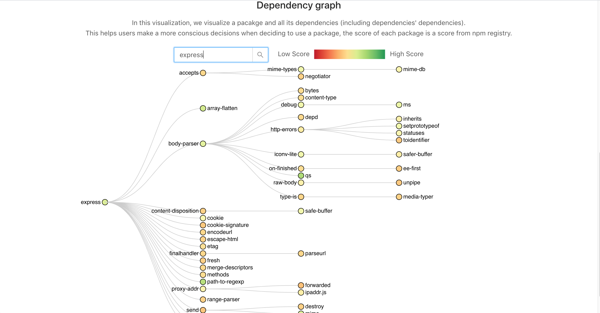
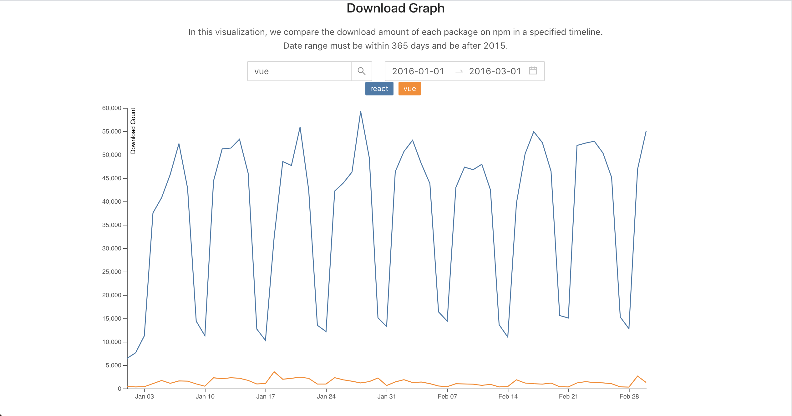

# npm-visualization 📈 🛠️

### Introduction
Visualizations of packages in the npm registry to help developers to choose their dependencies. This utilizes the npm registry public
[API](https://github.com/npm/registry)

[Deployed here](http://npm.tools/)

### Contribute
Feel free to contribute. The repo uses React for front end, Express with Typescript for back end and is currently hosted on aws.

#### Front end
'''
yarn install
cd frontend
yarn start
'''

#### Back end
Remember to enable CORS
'''
npm install
npm run dev
'''
